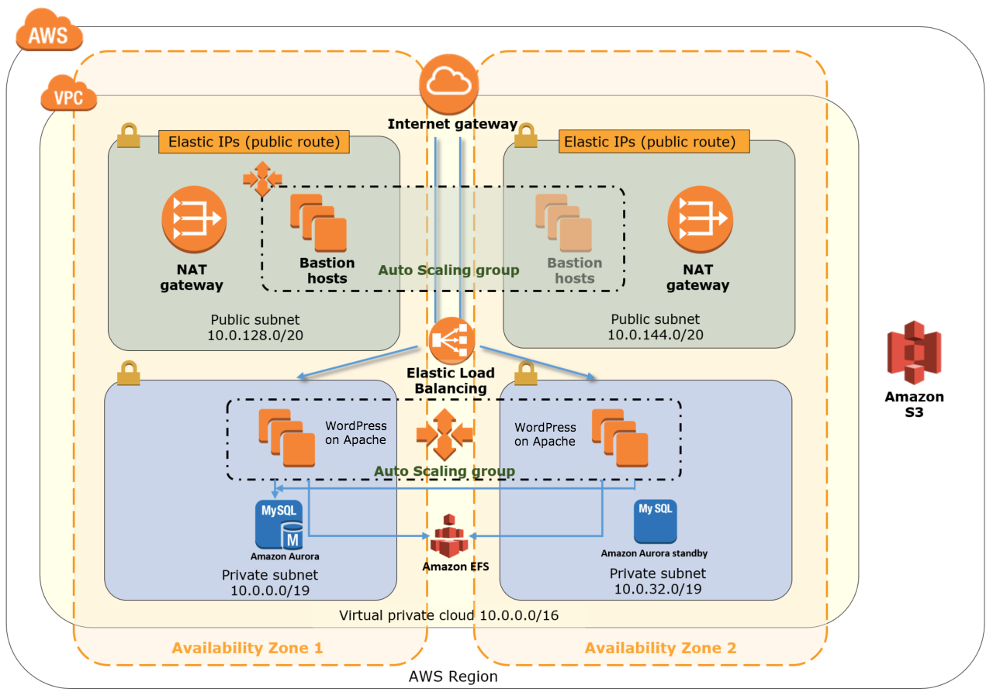

# WordPress on the AWS Cloud
## Quick Start Reference Deployment

WordPress is one of the world’s most popular web publishing platforms for building blogs and websites. It can be customized via a wide selection of themes, extensions and plugins.

This Quick Start deploys a WordPress architecture for high availability on the AWS Cloud.

For more details, see the [Quick Start WordPress deployment guide](docs/deployment_guide.pdf).

## Quick Links

The links in this section are for your convenience. Before you launch the Quick Start, please review the prerequisites for deployment discussed in the [Deployment guide](docs/deployment_guide.pdf). If you have an AWS account, and you’re already familiar with AWS services and with WordPress, you can launch the Quick Start. The deployment takes about half an hour.

- [View template for deploy WordPress into an existing VPC](templates/wordpress.template)
- [View template for deploy WordPress into a new VPC](templates/wordpress-master.template)
